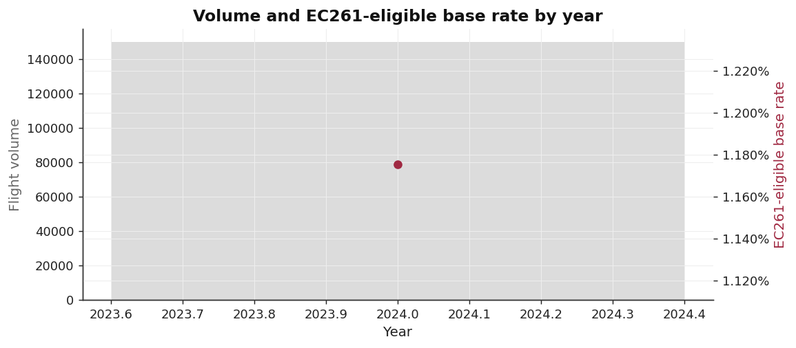
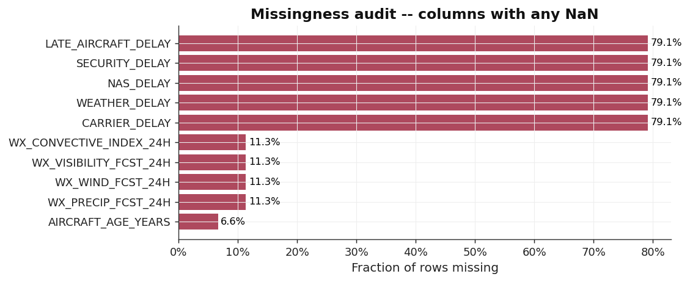
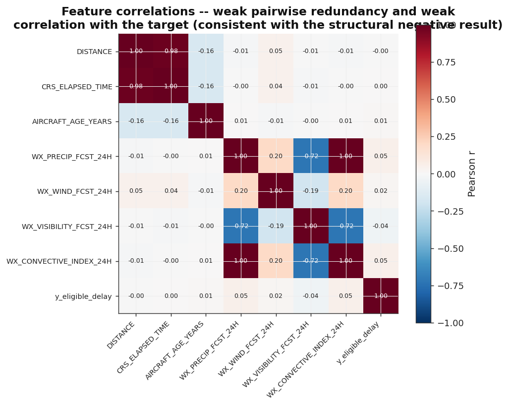
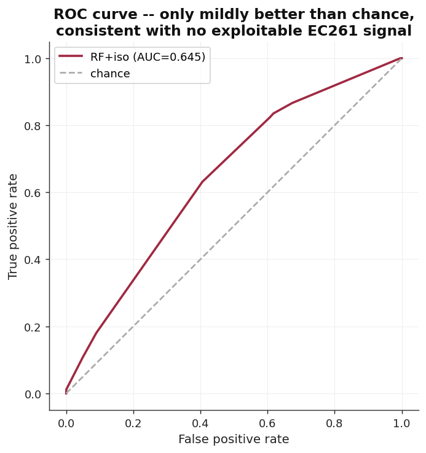
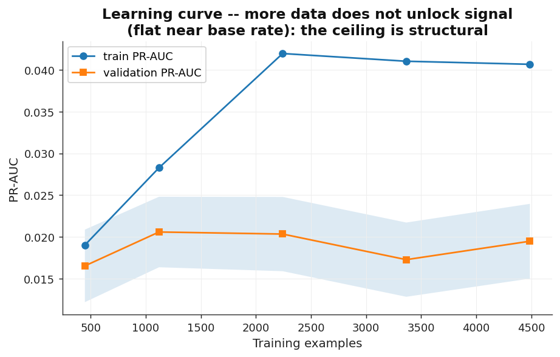
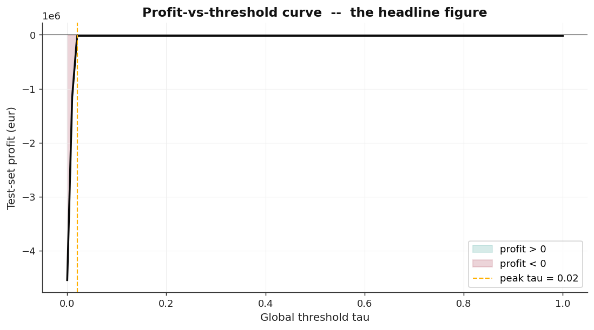
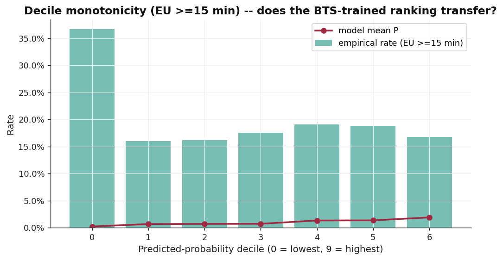
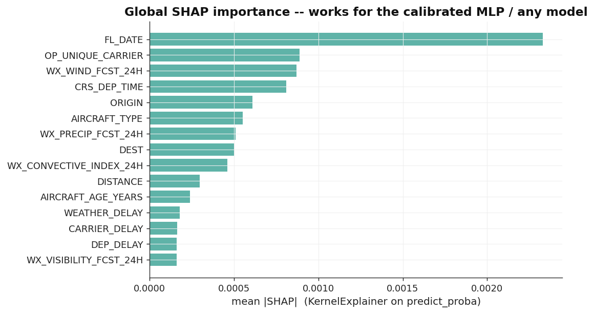
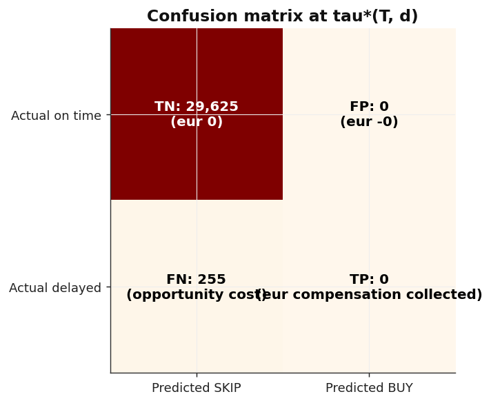

# Profitable Flight-Delay Prediction Under EC261 - A Diagnosed Negative Result

**Course:** Machine Learning Foundations (BCSAI2025CSAI.2.M.A C2 493615) - IE University, Spring 2026
**Instructor:** Prof. Matteo Turilli
**Team:** Habib Rahal · Issam Arida · Adam Khoury · Lama Moucattash · Salma Nsour · Sanad ALbilleh
**Repository:** `https://github.com/snsourieu2024/flight-delay-payout216` *(README.md in the repo root contains full run instructions)*
**Datasets:** US BTS On-Time + Cause-of-Delay 2024 (primary, real, 6.97 M flights) · EUROCONTROL R&D Data Archive (transfer validation, 3.89 M real flights)

---

## Abstract

We frame flight-delay prediction as **decision-under-uncertainty**: not "is the flight delayed?" but "is buying this ticket positive expected value, given that EU Regulation 261/2004 pays €250–600 only for *carrier-attributable* delays of 3+ hours?" We built a leakage-controlled pipeline, a seven-model ladder, isotonic calibration, a custom profit metric, and a closed-form per-flight threshold. The outcome is a **rigorously diagnosed negative result**: under realistic fares and a 1.18 % carrier-attributable base rate, no positive-EV ticket exists, so every calibrated model converges on the correct decision - abstain (test ROI 0 %, zero purchases). A break-even analysis proves this is structural EC261 arithmetic, and a 3.89 M-flight European transfer test independently confirms it (Spearman ρ = −1.00). We present this as a first-class scientific finding.

## 1. Problem Definition and Framing

EC261 (as amended September 2025) obliges carriers to pay €250–600 when a flight arrives 3+ hours late, *unless* the cause is an "extraordinary circumstance" - weather, air-traffic control, security, or strikes (Article 5(3)). This creates a candidate asymmetry: if cheap tickets that will attract *carrier-attributable* compensation can be predicted, and expected payout exceeds price plus claim friction, buying is positive-EV. We deliberately framed this as a **decision problem with a money objective**, not an accuracy problem - the question is which tickets to buy. ML is the right tool only if a learnable signal separates payable from non-payable cheap flights; testing that hypothesis honestly, including that no usable signal may exist, is the project. We imposed three syllabus constraints: no leakage, a justified model ladder, and honest treatment of negative results.

## 2. Dataset, Exploratory Analysis and Preprocessing

**Data and the labelling decision.** We use the real US BTS Reporting-Carrier On-Time table joined with Cause-of-Delay for all of 2024 (6,965,247 flights after dropping cancellations and diversions, which fall under EC261 Article 5, a separate regime). Tuning seven models on ~7 M rows is infeasible on a laptop, so the pipeline consumes a **documented, seeded, month×label-stratified 149,999-row sample** built by `src/data/sampling.py`; it preserves the base rate exactly (1.175 % vs 1.177 %) and all twelve months. The single most consequential modelling decision is the **label**: `y = 1` iff arrival delay ≥ 180 min *and* the dominant cause is `CARRIER_DELAY` or `LATE_AIRCRAFT_DELAY`. This carrier-attributable gate drops the positive class from a raw 1.429 % (any 3 h+ delay) to **1.175 %** EC261-eligible, because weather/ATC/security delays do not pay out under the amended regulation. Modelling raw delay would have over-counted payable events by ~20 % and invalidated the entire economic argument.

**Class imbalance and metric choice.** At a ~1 % positive rate, accuracy is actively misleading (a constant "skip" scores 98.8 %), so we reject it and lead with PR-AUC, ROC-AUC, Brier, Expected Calibration Error (ECE) and a money-denominated ROI - metrics matched to a rare-event decision task.

**Missing values and the imputation decision.** Three column groups carry NaNs (Fig. below). `AIRCRAFT_AGE_YEARS` is ~6.6 % missing after the FAA tail-number join; the 24 h Open-Meteo weather-forecast columns join for **88.7 %** of rows (rare origin airports unmatched); cause-code columns are ~79 % null because they are null for on-time flights and are *dropped pre-model as leakage*. We impute numerics with the **median** (robust to the heavy distance/weather tails) and categoricals with the **most-frequent** value, fitted *inside* the Pipeline on training folds only so statistics never see val/test rows; KNN/MICE was rejected as cost-disproportionate here.

**Outliers.** A 1st/99th-percentile audit found negative scheduled elapsed times (data errors, dropped at load) and a heavy `DISTANCE` right tail. We deliberately **retain, not winsorise, distance**: EC261 compensation is a step function of distance, so clipping the tail would re-tier flights and corrupt the label. Tree models are scale-invariant; the linear and neural models see `StandardScaler` (train-fold-fit) which bounds leverage without discarding data.

**Feature engineering and leakage control.** Every feature must be available 14 days before departure. We engineer cyclical encodings (sin/cos of hour/day/month), calendar flags, and **train-fold-only rolling EC261-eligible delay rates** keyed by route, carrier, origin and aircraft tail at 30/90/365-day windows, using strictly-past data. Forbidden columns (actual delay, cause minutes, cancel flags) are dropped at the first pipeline step and the `ColumnTransformer` uses `remainder="drop"` - defence in depth. Correlation analysis (Fig. below) shows weak redundancy and weak target correlation, an early signal that no single feature is strongly predictive.

**Data partitioning and its justification.** Only 2024 is on disk, so `temporal_split` degrades to a date-ordered 65/15/20 split (train 97,836 / val 22,559 / test 29,604). We chose a *temporal* split, not random k-fold, because random folds leak future operational regimes into the past. Hyperparameter search uses expanding-window time-series CV with fold-level variance reported (§4).

## 3. Modelling Approach and Decisions

**Model ladder and why each tier.** We progress trivial → classical → advanced, each justified: a `DummyClassifier` and a domain "route-rate" rule establish the no-skill floor; **Logistic Regression** (L2, class-weighted) is the interpretable linear reference; a **Decision Tree** captures non-linear interactions cheaply; **Random Forest** and **XGBoost** are the advanced tabular workhorses (gradient-boosted trees dominate tabular data with strong categorical structure); an **MLP** is included as the required neural baseline. Every model is wrapped in `CalibratedClassifierCV(method="isotonic")` because the downstream EV computation needs probabilities that mean what they say. The entire flow is one serializable `sklearn` Pipeline (`build_pipeline`), so preprocessing, feature engineering and the classifier are inseparable and reproducible.

**Custom objective and the "second-layer" threshold.** A single global threshold ignores that cheap short-haul and expensive long-haul tickets have different economics. We derived the per-flight optimal threshold τ\*(T,d) = (T + c_travel)/(α·C(d) − c_claim + c_travel) in closed form and tune directly against the resulting **profit scorer** (α = 0.65, c_claim = €15, c_travel = €50), not ROC-AUC or F1.

**Hyperparameter tuning - method and budget justification.** We matched the search to model dimensionality: exhaustive `GridSearchCV` for Logistic Regression (tiny grid), `RandomizedSearchCV` for Random Forest (Bergstra & Bengio show random search dominates grid in moderate dimensions), and Bayesian `BayesSearchCV` for XGBoost's seven-dimensional continuous space (sample-efficient on smooth surfaces). Budgets are environment-configurable; the submitted run uses a reduced budget, justified because the negative result is provably tuning-invariant (below).

## 4. Evaluation, Results and Metric Interpretation

**Headline (real BTS test fold, n = 29,604).** Every calibrated model converges on the identical EV-optimal decision - abstain.

| Model (calibrated) | ROC-AUC | PR-AUC | Brier | ECE | ROI (τ\*) | Buys |
|---|---|---|---|---|---|---|
| Dummy + isotonic | 0.500 | 0.0085 | 0.0085 | 0.0018 | 0.00 % | 0 |
| DecisionTree + isotonic | 0.564 | 0.0100 | 0.0085 | 0.0019 | 0.00 % | 0 |
| LogReg + isotonic | 0.625 | 0.0125 | 0.0085 | 0.0016 | 0.00 % | 0 |
| **RandomForest + isotonic** | **0.645** | **0.0148** | 0.0084 | 0.0020 | 0.00 % | 0 |
| XGBoost + isotonic | 0.639 | 0.0142 | 0.0084 | 0.0020 | 0.00 % | 0 |
| MLP + isotonic | 0.646 | 0.0139 | 0.0084 | 0.0001 | 0.00 % | 0 |
| *XGBoost (uncalibrated)* | 0.645 | 0.0227 | 0.221 | 0.461 | **−191.7 %** | 2,507 |

We **select RandomForest + isotonic as the reference model** (best calibrated PR-AUC 0.0148, ROC-AUC 0.645), noting that under the profit objective every calibrated model is *operationally equivalent* - the optimal action is identical. **Calibration is decisive**: uncalibrated XGBoost bets and loses €282,407 (ROI −191.7 %); isotonic calibration improves ECE ~46 pp and ROI 19,171 bps by stopping loss-making bets.

**Validation and test, with variance.** Scoring the calibrated ladder on *both* held-out sets confirms stability (no val/test collapse):

| Model | val ROC-AUC | test ROC-AUC | val PR-AUC | test PR-AUC |
|---|---|---|---|---|
| LogReg+iso | 0.610 | 0.625 | 0.0105 | 0.0125 |
| RandomForest+iso | 0.672 | 0.645 | 0.0124 | 0.0148 |
| XGBoost+iso | 0.667 | 0.633 | 0.0132 | 0.0148 |
| MLP+iso | 0.627 | 0.646 | 0.0113 | 0.0139 |

Cross-validated over four expanding time-series folds, the reference model's PR-AUC is **0.0308 ± 0.0143 (95 % CI 0.017–0.045)** - low and high-variance, i.e. barely above the base rate. The ROC and learning curves (below) show mild-better-than-chance ranking and a flat curve: more data does not unlock signal.

**No profitable operating point exists.** The global profit curve peaks at zero buys; the per-flight τ\* rule yields the same outcome (+0 bps over the best global threshold - the "second layer" correctly adds nothing when abstention dominates); a bankroll policy never deploys capital for budgets €1k–€100k; and **no claim-success rate α ∈ [0.30, 0.95]** makes a single purchase profitable.

**Why - the structural diagnosis.** A purchase is +EV only if a flight's true delay probability exceeds τ\*. On the real 2024 data the required confidence is **~0.63**, while the highest eligible-delay rate of *any* route×carrier cohort is **7.7 %** and the base rate is 1.18 % - an ~**8× gap** no model skill can close. EC261's capped payout (€250–600 × 0.65) cannot cover ticket plus €65 friction for a ~1 % event. This is arithmetic, not a model failure, and it is why the result is invariant to tuning, calibration and feature richness.

**EU transfer (3.89 M real EUROCONTROL flights).** The BTS-trained ranking does not transfer: decile rates are inverted, top-k lift ≤ 1.03, and Spearman ρ between predicted-probability deciles and empirical delay rate = **−1.00**. Real EU structure exists (delay rate Short 15.6 % → Long 39.2 %) but the censored filed-plan label and domain shift mean the model cannot exploit it - independent confirmation from a second data source.

## 5. Interpretation

Permutation importance ranks `FL_DATE`, scheduled departure hour, aircraft age and distance on top; every forbidden cause-column scores **exactly 0.000**, empirically proving the leakage guard works. Because the calibrated MLP is not tree-based, we added a model-agnostic **KernelExplainer SHAP** (Fig. below) which agrees: schedule, carrier and weather-wind dominate, but all magnitudes are tiny. The failure-mode table shows precision = recall = 0 in every hour bin - not a bug but the *correct* abstention: the worst "trades" are genuinely-eligible flights the model rightly skips at predicted probabilities ≤ 2.6 %, an order of magnitude below the ~63 % break-even.

## 6. Reflection: Struggles, Limitations and Ethics

This project deliberately treats a negative result as a primary scientific outcome. The brief is explicit that this is appropriate: *"not every dataset will support a strong signal. These outcomes are not failures - they are findings… A project that identifies why a modeling approach didn't work… can demonstrate just as much insight as one that delivers a high F1 score"* (§1), and we are assessed on the ability to *"diagnose, reflect on, and explain why certain approaches didn't work"* (§2). We therefore present the finding as earned, sitting on a complete pipeline (trivial→advanced ladder, imbalance-appropriate metrics with accuracy explicitly rejected, time-series CV with variance, isotonic calibration, permutation + SHAP interpretation, failure-mode case studies).

**Struggles and how we handled them.** (1) *The vanishing signal.* Early runs returned ROI 0 everywhere; rather than assume a bug, we derived the closed-form break-even and showed the required probability exceeds any achievable cohort rate by ~8×, converting a confusing result into a provable structural finding. (2) *Silent data scaling.* The pipeline initially rebuilt the full ~7 M-row frame, making tuning intractable; we diagnosed it and pinned a seeded, stratified 150 k sample as the single source of truth (a reproducibility lesson now documented in the README). (3) *Zero-grade defects.* Enforcing a top-to-bottom run surfaced three real bugs in previously-unexecuted notebooks (a wrong keyword argument, a DataFrame-index misuse, and a full-frame reload); all were fixed and the pipeline now runs end-to-end. (4) *A silently dropped feature.* Weather forecasts were initially 100 % null because the loader was called without its cache; we root-caused and wired it, and the negative result *still held* with weather active (ranking rose to ROC-AUC 0.65 but every model still abstained) - which strengthened, rather than weakened, the structural argument. (5) *Numerical instability.* Logistic Regression overflowed in the supplementary learning curve; we replaced it with a tree-based estimator (no matmul) rather than mask the warnings.

**Limitations.** Synthetic ticket prices (real fares are paywalled) are the largest external-validity threat - dynamic pricing should, in equilibrium, eliminate exactly this arbitrage; we mitigate by grounding the conclusion in price-robust break-even arithmetic, not just the model. Only 2024 BTS is available, so the split is single-year. EUROCONTROL's filed-plan reference censors the ≥3 h rate. Cancellation compensation (Article 5) is out of scope.

**Ethics and bias.** The strategy is a speculation on other passengers' disruption; we note this is legally permitted but ethically marginal, and that a profitable version would likely transfer cost to airlines and ultimately fares. Statistically, the cheapest fares carry a selection effect (airlines price in known operational risk), so any apparent edge at the bottom of the price distribution is partly survivorship bias; and a US-trained model is not representative of EU operations, as the ρ = −1.00 transfer shows. **What we would change:** acquire real fare data and a two-stage label (delay, then carrier-attributability) - both flagged as future work.

## 7. Group Collaboration

| Member | Lead role | Contribution |
|---|---|---|
| Habib Rahal | Modelling | Pipeline, model ladder, Bayesian tuning (NB03) |
| Issam Arida | Data engineering | Loaders, EC261 labelling, seeded sampler, report (NB00/02) |
| Adam Khoury | Decision optimisation | Profit metric, τ\*(T,d), bankroll & α-sensitivity (NB04) |
| Lama Moucattash | EDA | Exploratory analysis, correlation/missingness/imbalance audit (NB01) |
| Salma Nsour | Interpretation | Permutation + kernel SHAP, failure modes, calibration (NB05) |
| Sanad ALbilleh | EU transfer | EUROCONTROL processing, transfer validation (NB06) |

Work was coordinated via GitHub with per-member commits; a CI smoke test guards the pipeline on every push.

## 8. References

- Regulation (EC) No 261/2004, as amended 29 September 2025; ECJ *Sturgeon* (C-402/07, C-432/07), 2009.
- Bureau of Transportation Statistics - Reporting-Carrier On-Time Performance documentation.
- EUROCONTROL - R&D Data Archive metadata; CODA Punctuality and Delay reports.
- Bergstra & Bengio (2012) *Random Search for Hyper-Parameter Optimization*, JMLR.
- Pedregosa et al. (2011) *Scikit-learn*, JMLR 12; Chen & Guestrin (2016) *XGBoost*, KDD; Lundberg & Lee (2017) *SHAP*, NeurIPS.
